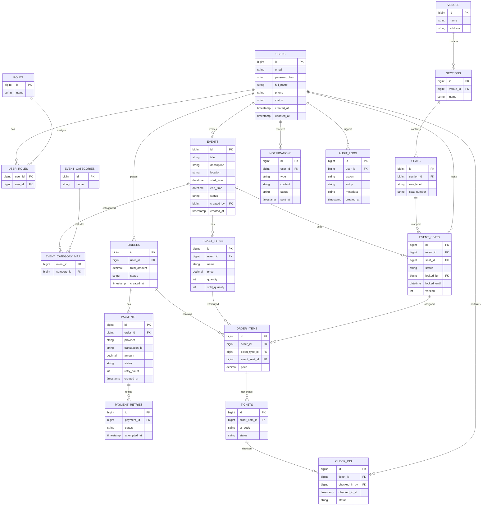

Dựa trên toàn bộ yêu cầu bạn đưa ra (user + admin + mở rộng), mình sẽ mô hình hóa **database schema ở mức production-ready cơ bản** bằng Mermaid ERD, đảm bảo:

- Tách rõ **User / Role / Permission**
- Event + Ticket + Seat mapping
- Order + Payment + Retry
- QR + Check-in + Anti-fraud
- Logging + Reporting foundation
- Có khả năng mở rộng (AI, CRM sau này)

---

## 🧩 Database Schema (Mermaid ERD)

---

## 🧠 Giải thích thiết kế (ngắn gọn nhưng quan trọng)

### 🔐 Authentication & Authorization

- `USERS`, `ROLES`, `USER_ROLES` → hỗ trợ RBAC
- Có thể mở rộng thành permission-level sau

---

### 🎟 Event & Ticket

- `EVENTS` tách riêng với `VENUES`
- `TICKET_TYPES` → vé thường / VIP / Early Bird
- `EVENT_SEATS` → giúp mỗi event có trạng thái seat riêng

---

### 💺 Seat Mapping (đúng chuẩn scalable)

- Venue → Section → Seat
- Mapping lại với event → tránh conflict nhiều event cùng venue

---

### 🛒 Order & Payment (production mindset)

- `ORDERS` + `ORDER_ITEMS`
- `PAYMENTS` + `PAYMENT_RETRIES` → xử lý retry payment
- Cho phép tích hợp:
  - MoMo
  - VNPay

---

### 📱 QR Code & Anti-fraud

- `TICKETS.qr_code UNIQUE`
- `CHECK_INS` → tracking scan
- Có thể detect:
  - Scan nhiều lần
  - Fake QR

---

### 📊 Reporting & Tracking

- `AUDIT_LOGS` → tracking hành vi
- `CHECK_INS` → tỷ lệ attendance
- `ORDERS + PAYMENTS` → revenue

---

### 📬 Notification

- `NOTIFICATIONS` → email / SMS (async sau này)

---

## 🚀 Gợi ý nâng cấp tiếp theo (nếu bạn build thật)

Nếu bạn muốn đi xa hơn production:

- Add:
  - `LOYALTY_POINTS`
  - `USER_BEHAVIOR_EVENTS` (tracking AI)
  - `RECOMMENDATION_CACHE`

- Tách microservice:
  - auth-service
  - event-service
  - payment-service
  - checkin-service

---

## 👉 Nếu bạn muốn tiếp

Mình có thể giúp bạn:

- Vẽ tiếp **System Design (High-level architecture)**
- Viết **SQL schema chi tiết (PostgreSQL/MySQL)**
- Generate **Spring Boot Entity + JPA**
- Hoặc **API contract (REST/GraphQL)**

Chỉ cần nói: _"tiếp phần X"_ 👍
