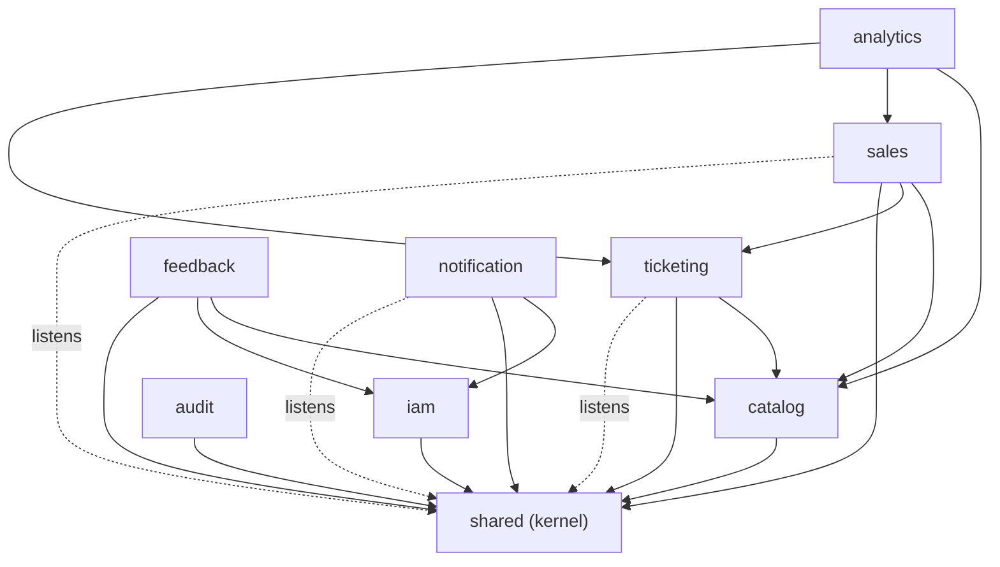

# Modulith module documentation

> Generated from the live module model by Spring Modulith's `Documenter`.
> Source of truth: the `@ApplicationModule` declarations in each module's
> `package-info.java` under `backend/src/main/java/com/odoomaster/ticketing/`.
> Decision record: [`adr/0011-spring-modulith.md`](../../adr/0011-spring-modulith.md).

The backend is a **Spring Modulith** application: a single Spring Boot deployment
sliced by **business capability** into 9 modules + a shared kernel, with the
boundaries **enforced** at build time by `ModularityTests.verify()`. Each module
exposes only the API types in its base package; entities, repositories and impls
live in a hidden `…​.internal` sub-package.

## Module dependency graph

`verify()` rejects any cycle or any dependency not declared in a module's
`allowedDependencies`. The enforced graph:



Solid edges are compile-time API calls (all inside one Spring transaction, so the
ordering hot path keeps its ACID/seat-lock guarantees). Dotted edges are the
event contracts in the shared kernel: `notification` reacts to `TicketsIssuedEvent`;
`ticketing` and `sales` react to `EventDeletedEvent` to purge their rows when an
event is deleted (the three cycle-breakers that keep `catalog` from depending on
`sales`/`ticketing`).

## Files

| File | What it is |
|---|---|
| `components.puml` | System-wide C4 component diagram (all modules + relations) |
| `module-<name>.puml` | C4 component diagram for one module and its allowed dependencies |
| `module-<name>.adoc` | Module canvas: base package, Spring components, exposed API, bean references, events |

The `.puml` files are [C4-PlantUML](https://github.com/plantuml-stdlib/C4-PlantUML);
render with any PlantUML tool, e.g. `plantuml components.puml` or the PlantUML/
Asciidoctor IDE plugins. The `.adoc` canvases render with Asciidoctor.

## Regenerating

These are a committed snapshot. To refresh after a module change:

```bash
cd backend
mvn test -Dtest=DocumentationTests        # writes target/spring-modulith-docs/
cp target/spring-modulith-docs/*.puml target/spring-modulith-docs/*.adoc \
   ../docs/architecture/modulith/
```

`DocumentationTests` (in `backend/src/test/java/com/odoomaster/ticketing/`) writes to
Documenter's default `target/` folder so a normal `mvn test` never dirties the repo.
