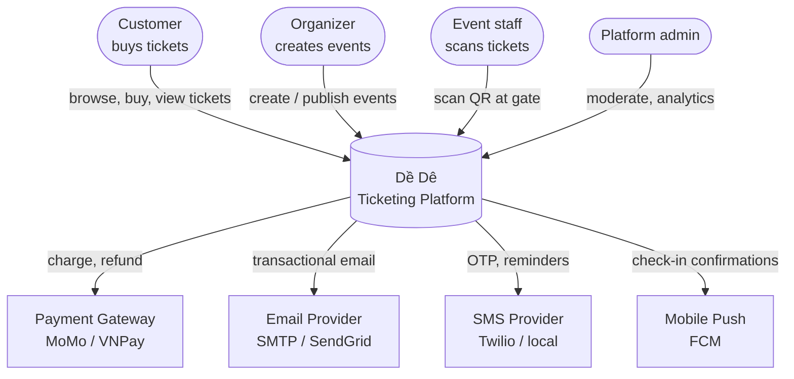
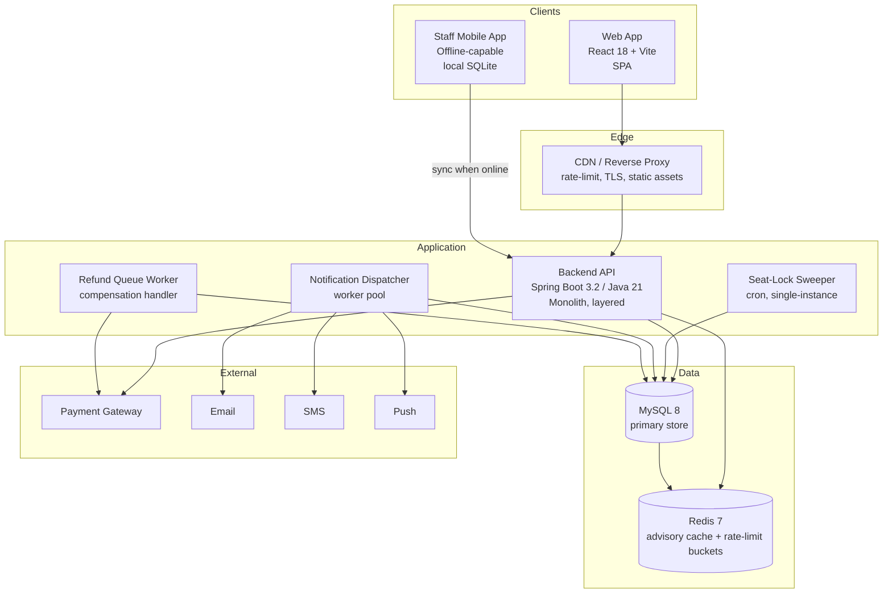
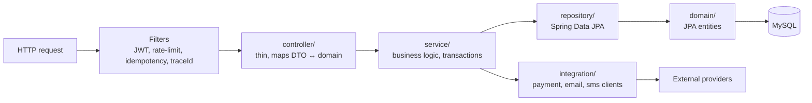
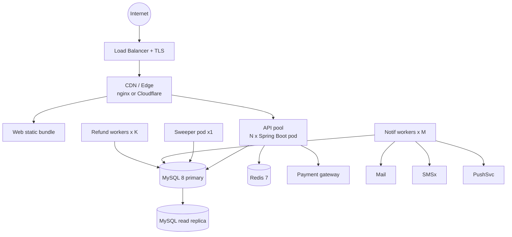

# System Architecture

> Status: DRAFT — initial baseline for Sprint 1.
> Audience: every contributor before they touch code.
> Companion docs: [`design-supplement.md`](../design-is/design-supplement.md) (flow detail), [`schema-definition.md`](../database-setup/schema-definition.md) (data), [`api/openapi.yaml`](../api/openapi.yaml) (contract), [`adr/`](../adr/) (decisions).

This document gives the single top-level picture of the system. Per-flow detail lives in `design-supplement.md`; decisions live in `adr/`. When those disagree with this doc, the ADRs win — this doc is a snapshot.

---

## 1. C4 — Level 1: System context

Who interacts with the system and what external systems we depend on.

**External dependencies** are all assumed to be unreliable. Every outbound call is wrapped in retry + circuit-breaker; user-visible flows have explicit fallbacks (see compensation flow in §3 of `design-supplement.md`).

---

## 2. C4 — Level 2: Containers

The runtime units we deploy and operate.

### Container responsibilities

| Container | Responsibility | Scaling model |
|---|---|---|
| **CDN / Edge proxy** | TLS termination, static asset cache, IP-tier rate limiting, HMAC challenge gate | Managed (Cloudflare / nginx) |
| **Web App** | Customer-facing SPA, organizer dashboard, admin console | Static, served from CDN |
| **Staff Mobile App** | Offline QR scan + sync; pre-fetches tickets for an event | One install per staff device |
| **Backend API** | All HTTP request handling; stateless except for Redis token-bucket cache | Horizontal — N replicas behind LB |
| **Sweeper** | Releases expired `EVENT_SEATS` locks every 10s | **Single instance** — DB advisory lock prevents duplicates (see ADR-0010) |
| **Notification Dispatcher** | Drains `NOTIFICATIONS` table to email/SMS/push | Horizontal — `SELECT … FOR UPDATE SKIP LOCKED` |
| **Refund Queue Worker** | Handles "PAID but ticket-issue failed" compensation | Horizontal; idempotent on `transaction_id` |
| **MySQL 8** | Source of truth for all domain data | Vertical first; read replicas if needed |
| **Redis 7** | Token buckets, advisory seat-availability cache, idempotency-key store | Single primary + replica |

### Why a monolith for Sprint 1

ADR-0001 captures the reasoning. Short version: a single Spring Boot deployable is easier to test, easier to reason about for golden-hour load, and keeps transactions in-process (the seat-lock + order + ticket-issue path is one transaction). Microservices come back on the table if specific bottlenecks demand it.

---

## 3. C4 — Level 3: Components inside the backend

Layering inside `com.odoomaster.ticketing` (matches the package layout in CLAUDE.md):

**Layer rules**

- `controller` never touches `repository` directly. Controllers handle HTTP concerns only.
- `service` owns transactions (`@Transactional`). One service method = one logical unit of work.
- `domain` is the JPA entity layer (not `entity/`, not `model/`).
- `integration` wraps external clients so test doubles plug in cleanly.

**Cross-cutting concerns**

| Concern | Where it lives |
|---|---|
| AuthN (JWT validation) | `security/JwtAuthenticationFilter` |
| AuthZ (RBAC) | Spring Security `@PreAuthorize` on service methods |
| Rate limiting | `security/RateLimitFilter` + Redis token bucket |
| Idempotency | `web/IdempotencyKeyFilter` + `IDEMPOTENCY_KEYS` table / Redis |
| Tracing | MDC `traceId` per request, propagated to logs |
| Validation | Jakarta Bean Validation on DTOs |
| Error mapping | `web/GlobalExceptionHandler` → standard error envelope (see `api/conventions.md`) |

---

## 4. Critical runtime paths

These are the paths that drive most architectural choices. Each has a detailed sequence diagram in `design-supplement.md`.

| Path | Why it's critical | Reference |
|---|---|---|
| Seat lock acquisition | Golden-hour race-loser correctness | §1 in design-supplement |
| Seat-lock expiry sweep | Prevents oversell / undersell from abandoned carts | §2 |
| Order → Payment → Ticket | "Charged but no ticket" is the highest-risk failure mode | §3 |
| Offline check-in sync | Mobile staff app must work without network | §4 |
| Rate-limit + HMAC challenge | Bot mitigation during sales open | §5 |

---

## 5. Deployment topology (Sprint 1 target)

### Capacity targets (from `GE-REQUIREMENT.md`)

| Target | Value | Source |
|---|---|---|
| Concurrent users | 10 000 | NFR §2.4 |
| Tickets per event | 50 000 | NFR §2.4 |
| Response time p95 | < 2 s | NFR §2.4 |
| Availability | 99.5 % | NFR §2.4 |

Verification belongs to the [load-test plan](../nfr-load-test-plan.md), not this document.

---

## 6. Environments

| Env | Purpose | Profile | DB | Notes |
|---|---|---|---|---|
| `dev` | Local laptop | `dev` | MySQL via Docker Compose | `ddl-auto: update`, SQL logging on |
| `test` | CI | `test` | Testcontainers MySQL | Flyway runs from clean DB each pipeline |
| `staging` | Pre-prod, load-test target | `prod` | Managed MySQL | Mirrors prod config; payment in sandbox mode |
| `prod` | Live | `prod` | Managed MySQL + replica | `ddl-auto: validate`; migrations only via Flyway |

See `docs/environment.md` for env-var details and `docs/database-setup/migration-strategy.md` for the migration tool decision.

---

## 7. Architecture invariants (what reviewers should reject)

These are not style nits — violating any of them breaks correctness or NFR targets:

1. **DB is source of truth for seat status.** Redis is advisory only; the `WHERE status='AVAILABLE' AND version=:v` clause stays in every seat UPDATE.
2. **One transaction per logical unit of work.** Seat-lock + order + payment-record write must commit or roll back together where applicable.
3. **The sweeper runs in exactly one place.** No sweep code in API request handlers.
4. **`ORDER_ITEMS.event_seat_id` `UNIQUE` constraint stays.** It is the last line of defense against double-booking.
5. **`TICKETS.qr_code` `UNIQUE` constraint stays.** No duplicate QRs ever.
6. **Idempotency-Key is honored for every state-changing POST.** No exceptions; replays must return the cached result.
7. **All external calls have timeouts.** No unbounded HTTP client. Defaults: 2s connect, 5s read.
8. **No business logic in controllers.** Controllers map DTOs; services do work.

---

## 8. Out of scope for Sprint 1

Tracked here so we don't accidentally build them:

- Microservice decomposition
- Kafka / RabbitMQ / dedicated message broker (using `NOTIFICATIONS` table — see ADR-0004)
- Multi-region deployment
- Real-time WebSocket seat-map updates (poll every 5s instead)
- AI-driven dynamic pricing / recommendation
- Native iOS / Android customer apps (web is responsive)

When any of these come back into scope, write a new ADR — don't edit this list silently.
