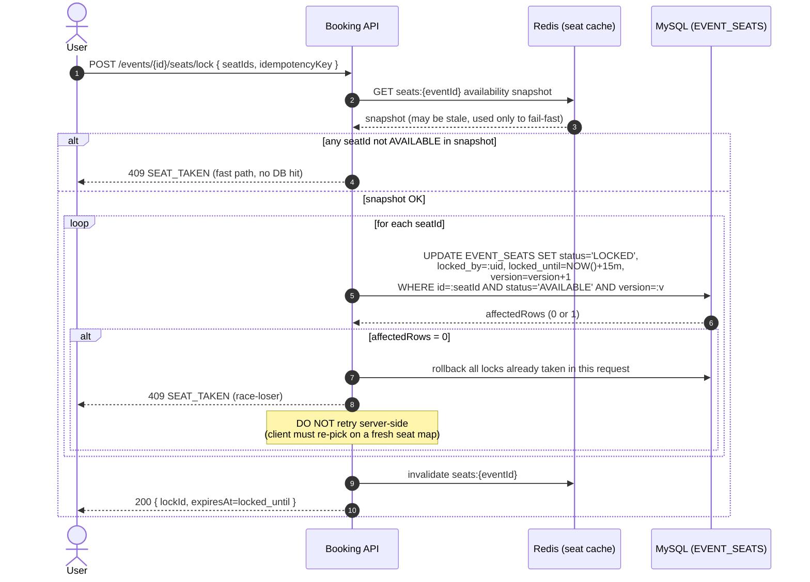
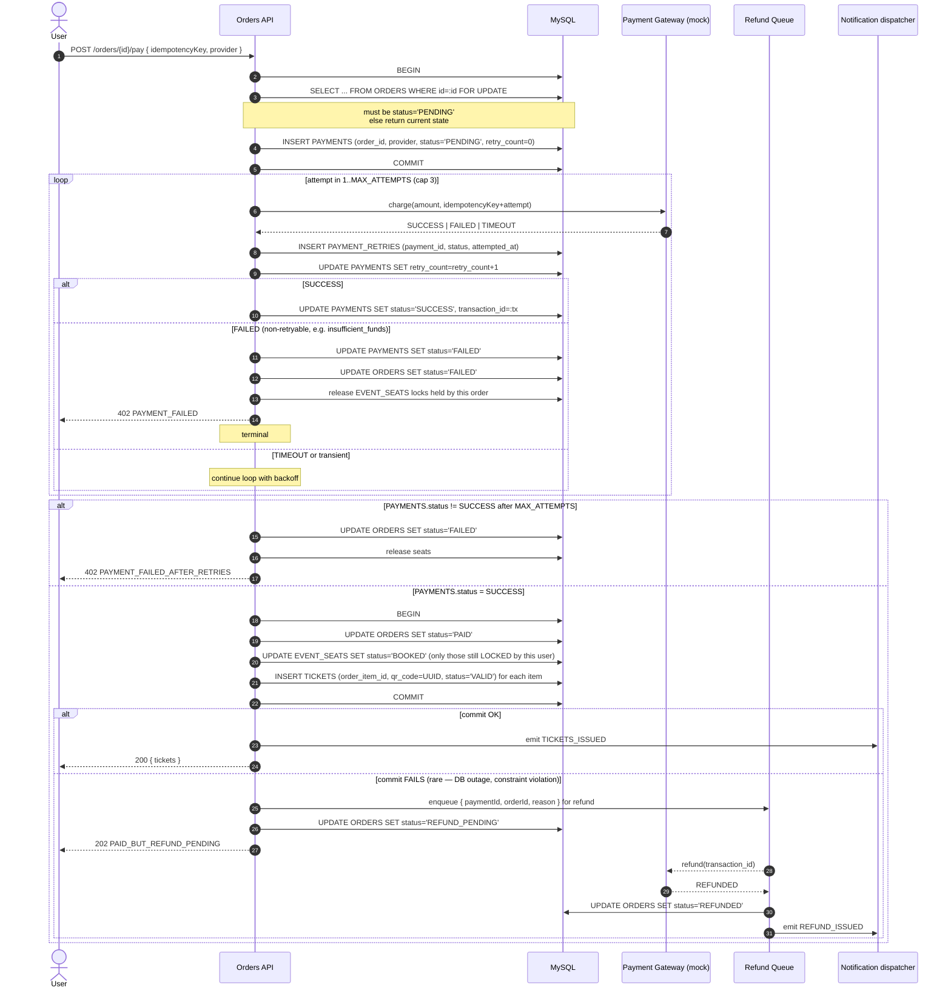
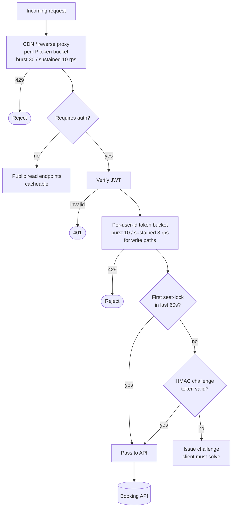
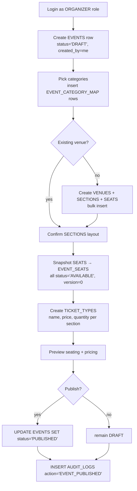
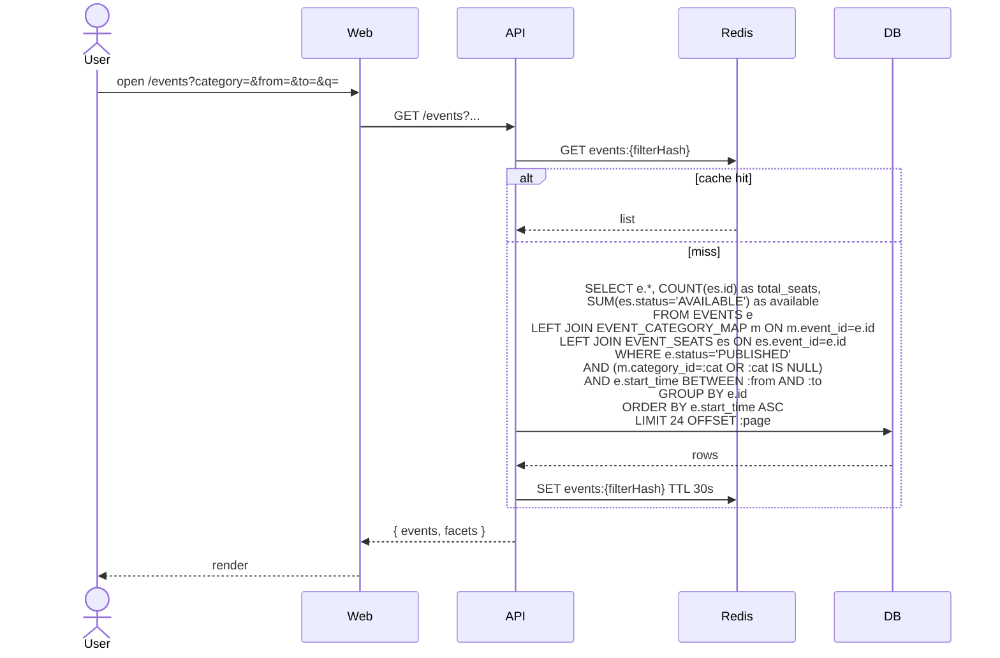

# Design Supplement — flows missing from the draw.io diagrams

> **Status:** Required reading before implementation. The existing `ActivityDiagramQLDA.drawio.xml` and `SequenceDiagramQLDA.drawio.xml` cover the user-facing happy paths (register, login, profile, basic booking, payment retry loop, QR generation, check-in). The flows below close the gaps identified in the audit against `GE-REQUIREMENT.md` and `docs/engineering/database/schema-definition.md`, and **must be reflected in code** even if they are added to the drawio files later.
>
> **Conventions used in this document**
> - **Optimistic lock** ⇒ `EVENT_SEATS.version`. Every UPDATE includes `WHERE version = :expected`; affected-rows = 0 ⇒ retry.
> - **Idempotency key** ⇒ client-generated UUID stored against the operation (order, payment attempt). Server is required to return the cached result on replay.
> - **Schema source of truth** ⇒ `docs/engineering/database/init_schema.py` and `schema-definition.md`. Field names below are exact column names.

---

## 1. Seat-lock acquisition with optimistic locking (golden-hour safe)

**Why it matters:** PO target = 10 000 concurrent. The schema gives us `EVENT_SEATS.status`, `locked_by`, `locked_until`, and `version`. The current diagrams use `lockSeats(...)` but do not show the race-loser path. Without this, two users will both think they got the same seat.



**Implementation rules**
- The `WHERE status='AVAILABLE' AND version=:v` clause is non-negotiable; do not lock seats via application-level mutexes.
- Lock all seats inside **one transaction**. If any seat fails the version check, ROLLBACK — never leave partially-locked carts.
- `idempotencyKey` is stored in an `ORDERS`-adjacent table (or Redis with 1h TTL); a replay returns the original `{lockId, expiresAt}` instead of re-locking.
- The fast-path Redis snapshot is **advisory only** — the DB UPDATE is the source of truth. Skipping the snapshot is acceptable; skipping the version check is not.

---

## 2. Seat-lock expiry sweeper (async)

**Why it matters:** `locked_until` is a timestamp, not a trigger. Without a sweeper, abandoned carts permanently hold seats and the system oversells / under-sells.

```mermaid
flowchart LR
    Start([Every 10s]) --> Q[SELECT id, event_id, locked_by FROM EVENT_SEATS<br/>WHERE status='LOCKED' AND locked_until < NOW()<br/>LIMIT 500]
    Q --> Any{rows?}
    Any -- no --> Start
    Any -- yes --> Tx[BEGIN]
    Tx --> Upd[UPDATE EVENT_SEATS<br/>SET status='AVAILABLE', locked_by=NULL,<br/>locked_until=NULL, version=version+1<br/>WHERE id IN (...)<br/>AND status='LOCKED'<br/>AND locked_until < NOW()]
    Upd --> Commit[COMMIT]
    Commit --> Inval[Invalidate Redis seats:{event_id}]
    Inval --> Notify[Insert NOTIFICATIONS rows<br/>type='SEAT_RELEASED' for affected locked_by users]
    Notify --> Audit[Insert AUDIT_LOGS<br/>action='SEAT_LOCK_EXPIRED']
    Audit --> Start
```

**Implementation rules**
- Single-instance job (use a DB advisory lock or a leader-election token) — do **not** run the sweeper on every API pod.
- Cap each pass with `LIMIT 500` so a backlog never blows out one transaction.
- Re-check `status='LOCKED' AND locked_until < NOW()` inside the UPDATE — a user might have just paid and bumped status to BOOKED between the SELECT and UPDATE.

---

## 3. Order → Payment → Ticket with compensation ("charged but no ticket")

**Why it matters:** Risk §2.8 of `GE-REQUIREMENT.md` calls this out by name. The current sequence diagram has a retry loop on payment but no rollback if payment succeeds and ticket generation fails. **This is the single highest-risk gap.**



**Implementation rules**
- One `idempotencyKey` per `POST /orders/{id}/pay` request. The gateway's idempotency key is `idempotencyKey + attempt#` so each retry is a distinct charge attempt on the gateway side but the *user-side* idempotency still prevents double-billing on client retry.
- `MAX_ATTEMPTS` and per-attempt backoff are config, not magic numbers. Suggested defaults: 3 attempts, 1s → 3s → 9s backoff.
- The "PAID but ticket-issue commit failed" branch is the **only** path that needs the refund queue. In normal operation it should never fire — but the schema (`ORDERS.status` enum, `PAYMENT_RETRIES`) gives us everything needed to recover safely.
- Add a state `REFUND_PENDING` and `REFUNDED` to the `ORDERS.status` enum (current schema has only `PENDING/PAID/FAILED/CANCELLED` — see schema migration note at bottom).

---

## 4. Offline check-in + sync

**Why it matters:** PO §2.4 + §2.5 explicitly require the mobile staff app to operate offline. Current diagrams show only the online happy path.

```mermaid
sequenceDiagram
    autonumber
    actor Staff
    participant App as Mobile App
    participant Local as Local SQLite
    participant API as Check-in API
    participant DB as MySQL

    Note over App: On event start, staff pre-downloads<br/>TICKETS for this event into Local<br/>(qr_code, status, order_item_id)

    Staff->>App: scan QR
    App->>Local: SELECT * WHERE qr_code=:scanned
    alt found AND status='VALID'
        App->>Local: UPDATE status='USED'<br/>INSERT pending_checkin row
        App-->>Staff: ✅ Hợp lệ
    else found AND status='USED'
        App-->>Staff: ⚠️ Đã quét trước đó
    else not found
        App-->>Staff: ❌ QR không hợp lệ
    end

    loop background, when online
        App->>API: POST /tickets/sync-offline { pending_checkins[] }
        API->>DB: BEGIN
        loop for each pending row
            API->>DB: INSERT INTO CHECK_INS (ticket_id, checked_in_by, checked_in_at, status)<br/>ON DUPLICATE KEY UPDATE checked_in_at=LEAST(checked_in_at, VALUES(checked_in_at))
            API->>DB: UPDATE TICKETS SET status='USED' WHERE id=:tid AND status='VALID'
            alt UPDATE affected 0 rows AND CHECK_INS already had a row
                API->>DB: INSERT AUDIT_LOGS action='DUPLICATE_OFFLINE_CHECKIN'
                Note over API: server keeps the earliest scan;<br/>flag duplicate for fraud review
            end
        end
        API->>DB: COMMIT
        API-->>App: per-row results
        App->>Local: clear synced rows; surface conflicts to staff
    end
```

**Implementation rules**
- `CHECK_INS.ticket_id` is `UNIQUE` — that's our de-dup primitive. Use `ON DUPLICATE KEY` (or `INSERT ... ON CONFLICT` semantics in the JPA layer) to keep the earliest scan.
- Mobile app must pre-fetch ticket data before going offline. Refresh window = event start − 2h.
- Conflicts (same QR scanned offline by two devices) are not errors — they're fraud signals. Always log to `AUDIT_LOGS` and surface in the analytics dashboard.

---

## 5. Rate-limiting & bot-attack mitigation

**Why it matters:** PO Risks §2.7, §2.8 ("Bot attacks during ticket openings"). Diagrams do not reference any rate-limit primitive.



**Implementation rules**
- Two-tier bucket: edge by IP (cheap) + user bucket inside the app (after JWT validation).
- A signed, short-lived HMAC challenge token is mandatory before `POST /events/{id}/seats/lock`. Token is issued by the events listing endpoint; bots that hit the lock endpoint directly without first calling the listing endpoint will be missing the token.
- All 429 responses include `Retry-After`. Failures emit `AUDIT_LOGS` rows with `action='RATE_LIMITED'` so analytics can spot patterns.

---

## 6. Organizer event creation (admin scope)

**Why it matters:** PO §2.5 requires "Event creation and management" but no diagram covers it.



**Implementation rules**
- `EVENT_SEATS` is materialized at event-creation time (not lazily on first lock). This is what guarantees deterministic capacity and lets the sweeper run a cheap query.
- `EVENTS.status` enum needed: `DRAFT`, `PUBLISHED`, `CANCELLED`, `COMPLETED`. The current schema column is `string`; tighten via app-side validation or a `CHECK` constraint.
- Only `PUBLISHED` events show in the public listing.

---

## 7. Events browsing (public)

**Why it matters:** No diagram covers it; UI mockups don't show filters.



**Implementation rules**
- 30s cache TTL on listing — keeps the listing endpoint cheap during golden hour without surfacing stale data for too long.
- The `available` column drives the "Còn X chỗ" badge in the UI. Computed at query time from `EVENT_SEATS`, not stored — this avoids the desync risk of a denormalized counter.

---

## 8. Notification dispatch (async, fan-out)

**Why it matters:** `NOTIFICATIONS` table exists; only the post-payment email is currently modeled. Other lifecycle events (seat released, refund, check-in reminder) are needed.

```mermaid
flowchart LR
    subgraph Producers
        P1[Payment success] -->|emit TICKETS_ISSUED| Bus
        P2[Sweeper releases lock] -->|emit SEAT_RELEASED| Bus
        P3[Refund queue] -->|emit REFUND_ISSUED| Bus
        P4[T-2h cron] -->|emit EVENT_REMINDER| Bus
    end
    Bus[(Notification bus / table-driven)]
    Bus --> Insert[INSERT NOTIFICATIONS<br/>user_id, type, content, status='PENDING', sent_at=NULL]
    Insert --> Worker[Dispatcher worker<br/>polls status='PENDING' LIMIT 100]
    Worker --> Route{type → channel}
    Route -->|email| SMTP
    Route -->|sms| SMS
    Route -->|push| FCM
    SMTP & SMS & FCM --> Mark[UPDATE NOTIFICATIONS<br/>SET status='SENT', sent_at=NOW()<br/>or status='FAILED' on error]
```

**Implementation rules**
- `NOTIFICATIONS` is the queue — no separate message broker required for Sprint 1.
- `type` enum: `OTP`, `TICKETS_ISSUED`, `SEAT_RELEASED`, `REFUND_ISSUED`, `EVENT_REMINDER`, `CHECKIN_CONFIRMATION`.
- Workers must use `SELECT ... FOR UPDATE SKIP LOCKED` (MySQL 8 supports it) when picking up rows so multiple workers can run safely.

---

## 9. Analytics aggregation

**Why it matters:** PO §2.5 requires sales/revenue reporting. Schema lists ORDERS, PAYMENTS, PAYMENT_RETRIES, CHECK_INS, AUDIT_LOGS as the foundation.

```mermaid
flowchart TB
    subgraph Live (read-on-demand, cached 60s)
        L1[Revenue today: SUM PAYMENTS.amount WHERE status=SUCCESS AND DATE created_at=today]
        L2[Tickets sold: COUNT TICKETS WHERE status IN VALID,USED]
        L3[Check-in rate: COUNT CHECK_INS / COUNT TICKETS per event_id]
        L4[Payment retry rate: AVG retry_count per PAYMENTS]
    end
    subgraph Rolled-up (nightly job)
        R1[Per-event sales by ticket type]
        R2[Per-category revenue]
        R3[Bot/fraud signals from AUDIT_LOGS action IN RATE_LIMITED, DUPLICATE_OFFLINE_CHECKIN]
    end
    Live --> Dash[Analytics dashboard]
    Rolled --> Dash
```

**Implementation rules**
- Live KPIs are SQL aggregations with 60s cache. No data-warehouse, no ETL — schema is small enough to query directly.
- Nightly job writes to a small `REPORT_DAILY` table (not in the current schema — add when needed; do not block Sprint 1 on it).

---

## Schema deltas implied by these flows

The schema is mostly ready, but to support the flows above, these small additions / tightenings are recommended:

| Table | Change | Reason |
|---|---|---|
| `ORDERS.status` | Extend enum: add `REFUND_PENDING`, `REFUNDED` | Compensation flow §3 |
| `EVENTS.status` | Tighten to enum: `DRAFT`, `PUBLISHED`, `CANCELLED`, `COMPLETED` | Organizer flow §6 |
| `NOTIFICATIONS.status` | Tighten to enum: `PENDING`, `SENT`, `FAILED` | Dispatcher §8 |
| `NOTIFICATIONS.type` | Document enum values (see §8) | Dispatcher §8 |
| New table `IDEMPOTENCY_KEYS` (optional) | `key VARCHAR(64) PK, response JSON, expires_at` | Idempotent POST endpoints |

None of these are blocking — the system can ship Sprint 1 with the schema as-is and add the enums in a Sprint-2 migration. The flows above are the implementation contract.
